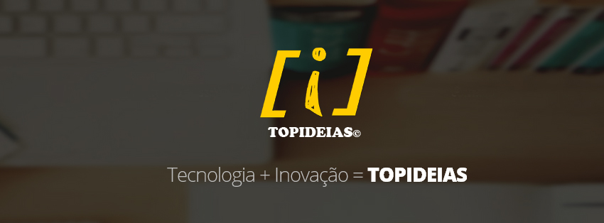

Vagrant Setup
===========

Ubuntu 14.04.3 LTS (Trusty Tahr)

Ambiente de Desenvolvimento PHP 7

### Pacotes Inclusos:

- Ubuntu 14.04.3 LTS (Trusty Tahr)
- Vim, Git, Curl, etc.
- Apache
- PHP7 with some extensions
- MySQL 5.6
- Node.js with NPM
- RabbitMQ
- Redis
- Composer
- phpMyAdmin

Pré-requisito: 
==============

- Virtualbox - https://www.virtualbox.org/
- Vagrant - http://www.vagrantup.com/
- Git - http://git-scm.com ( Opicional )

Instale o Virtualbox e o Vagrant de acordo com seu sistema operacional.

Instalação
===========

* Clone esse repositório para sua máquina no terminal: `https://github.com/soterojunior/topideias_vagrant_php7.git`

* Acesse o repositório e inicie a máquina virtual com o comando: `vagrant up`

O Vagrant irá baixar o sistema operacional ( isso pode demora um pouco ), irá configurar a máquina virtual no VirtualBox e posteriormente baixar, instalar e configurar todos os pacotes do script `bootstrap.sh`.

Quando tudo estiver pronto, um servidor web estará disponível no endereço `http://localhost:8080`, e a instalação do PHPMyAdmin está em `http://localhost:8080/phpmyadmin`, para acessar utilize:

- Login: root
- Senha: root

obs:(A senha padrão para todos os serviços é vagrant).

Coloque seu código no diretório `www` do repositório. Todo o conteúdo dele estará disponível via `http://localhost:8080`. (Como teste, já existe um arquivo index.php que chama a função phpinfo() ).

Para desligar a máquina virtual utilize o comando: `vagrant halt`

Para religar novamente utilize: `vagrant up`

Caso queira destruir a máquina virtual (o conteúdo do www não será excluido): `vagrant destroy`

Top Ideias

[http://www.topideias.com.br](http://www.topideias.com.br)
